## 
**Final Report Group 32**
 
Student: Jacob Liu, Jingtao Yang, Qianyu Shang¶
### **Introdauction**
---

Our team members gathering together because our love toward video games. League of Legends and Teamfight Tactics are our favorites. Teamfight Tactics is a multiplayer strategy game where the ultimate goal of the player is to defeat other players. Therefore, understanding the psychology and strategy of other players is the key to winning the game. We are all familiar with TFT's mechanics and wish to beat other players and achieve higher rankings. Researching Teamfight Tactics' ranked stats caters to our interests and allows us to learn more about other players to improve our game strategy. Furthermore, the essence of video games is code and data. Studying the data on TFT allows me to understand how game makers design the interaction of game characters and how to balance competitive games in order to enhance the game's playability and the player's gaming experience.

### **Exploratory Data Analysis**
---
 
 

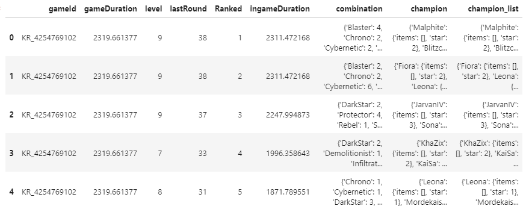
 

The table below is what our original dataset looks like. There are 8 variables in total, including the following: "gameID"- ID of the gamer; "gameDuration"- total duration of the game; "lastRound"- last round before death; "Ranked"- gamer's final rank; "ingameDuration"- time spend for the player; "Combination- shows what combination synergy each participant in the game has; "Champiom"- shows which champions each of the eight players set. And also there 10000 rows of data collected from the TFT game.

 

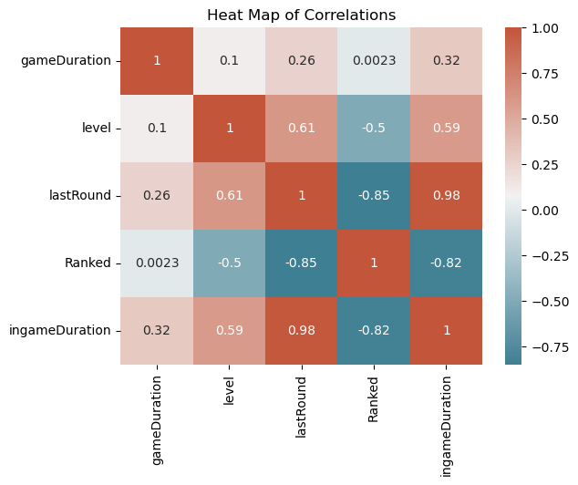
 
 
The plot above is a heatmap of correlations. Based on our definition of 'Ranked', the lowest value, integer 1 means the winner/top rank of each play, and 8 means the bottom rank of the play. From the HeatMap above, we can see that there is a positive correlation between lastRound and ingameDuration - the more rounds a player played the more ingameDuration the player has.
 

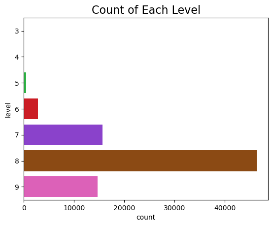

 
 
The plot above show the counts of obervation in each level. Most people end the game when they are at level 8. Rarely people end the game when they are below level 6.
 
 

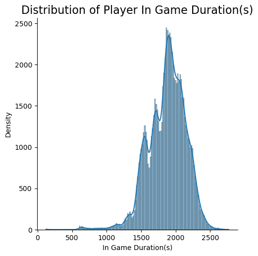

The plot above is the distribution of in game duration. Through caculation, we knew that the mean is 1875, the median os 1897. Notice that the mean is less than the median and the distribution of this plot is skewed to the left. For data from skewed distributions, the median is better than the mean for measuring central tendency, because it isn't influenced by extremely large values. Most people end the game at 1897 second.
 
 

### **Reasearch Question 1**: Which champion is the most commonly used in rank Master? And which champion is the least used? 
---
 To answer this question, I used the data from Master data set, took the first 1000 games as sample, to count how many time each champion has been used within the 1000 games.[You can find the full analysis notebook here, including the code and the data here.](notebooks/analysis1.ipynb)
 

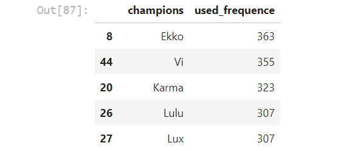
 
 
This is the final dataset. It includes the name of the champions and the requence of them being used. We can see that champion "Ekko" has the highest number, indicate that it is the most used champion by players within the 1000 games.
  

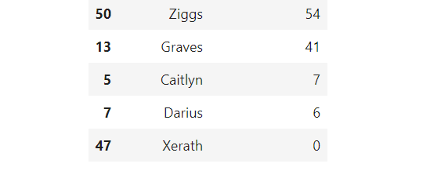
 
 
This is the tail of the dataset, we can see that for champion 'Xerath", it was never used within the 1000 games, indicate that it is the least used champion by players

  
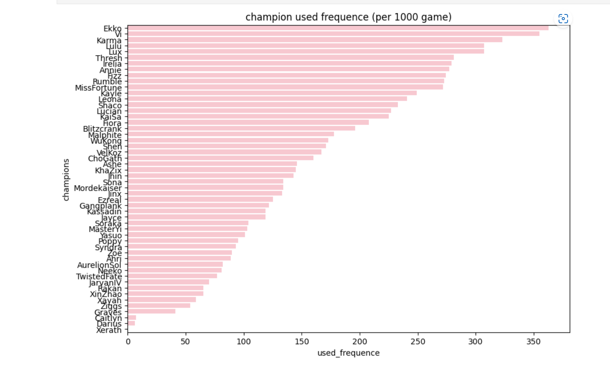
 
 
This sorted barplot clearly indicate the usage of the champions by times, where Ekko has the longest bar, and Xerath has the shortest. 
So with the analysization, we can conclude that: in "Master" rank, champion "Ekko" is the most commonly used champion, while "Xerath is the least commonly used champion.
### **Reasearch Question 2**: what are the most commonly used TFT combinations for the first-ranked players at grandmaster?
---
 

To answer this question, we had cleaned and processed the raw dataset to desired dataset by following the common steps of a Data Analysis Pipeline. To summary, we just keep the combination for ranked is 1, expand the combination column and count the usage of all combinations at different levels.
[You can find the full analysis notebook here, including the code and the data here.](notebooks/analysis3.ipynb)

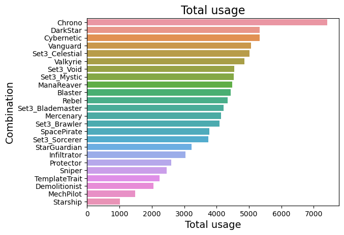

To summarize the overall usage of all combinations I add up all levels of usage for each combination. Now, we can clearly observe that in general "Chrono" is the most popular combination and it is still significantly different from the next popular combination. Also, the 'DarkStar' and 'Cybernetic' are the second and third most commonly used combination in general. However, 'Chrono' may be not the most commonly used combination if we also consider the level of combination. Then I gonna make a heatmap to observe the relation between combination usage and combination level. 
 
 

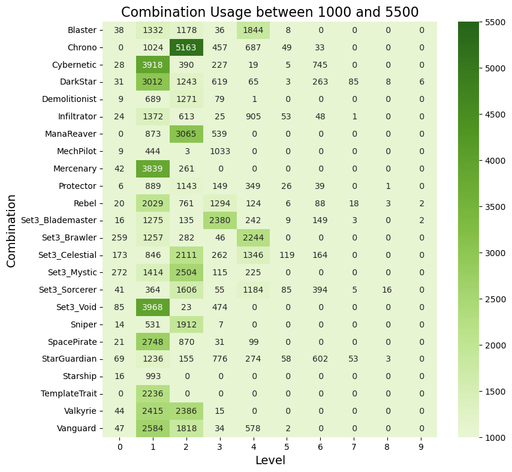
 

The above visualization is a heatmap about differen levels of combination usage during the TFT games. The heatmap above giving obvious visual cues to the reader about how the phenomenon is clustered or varies over space. Through the distinct color distribution, we can see how majority of TFT players select combination with the combination level beween level 1 and level 4 . And most of the players(5163) chose to select level 2 Chrono combination during their games. And second most players chose to select level 1 'Cybernetic'(3918), level 1 'set3_Void'(3968) or level 1 'Mercenary'(3839) in the games.  From this visualization we can only conclude which is the most popular combination between level 1 and level 4, since the value of usage between level 5 and level 9 are significant different from the value of usage between level 1 and level 4. 
 
 

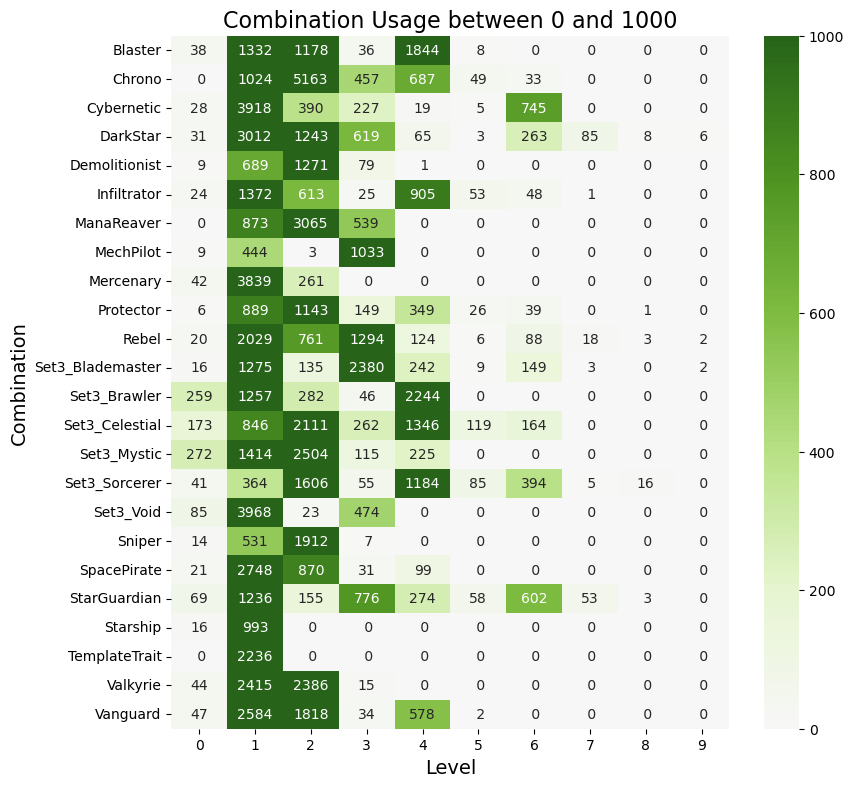
 
Although most players chose the lower level combination and few used the higher level ones, there were still many players in the game who chose the level 6 'Cybernetic' (745) and level 6 'Star Guardian' (602) combination. The higher the level of the combo, the less players choose. There are only 6 players selected level 9 'Dark Star'
 
 

### **Reasearch Question 3**: Which item is the most commonly used in the TFT game among Grand Master level players 
---
My raw data is from the grand master's csv file, and below is my final dataset, which is grouped by the unique items used along with their frequencies.
 

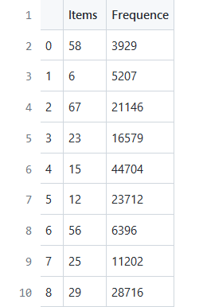

 
 
By importing and calling my project python function, I created a table, and the 'items_dict' column shows the item combinations used by each champion. Unique items are represented by assigned numbers. [You can find the full analysis notebook here, including the code and the data here.](notebooks/analysis3.ipynb)
 
 
 

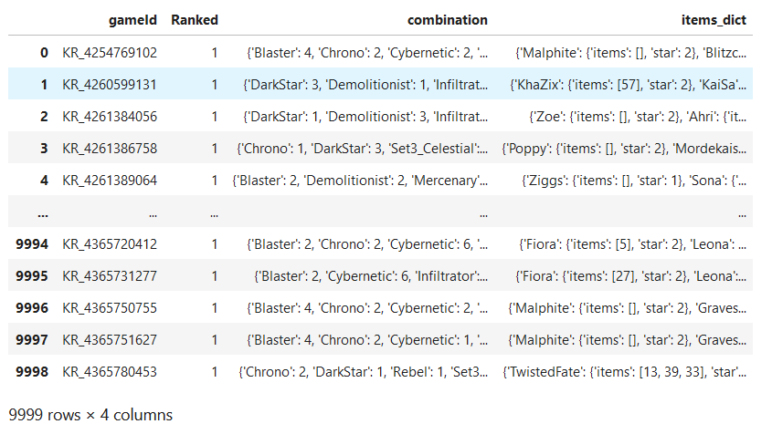
 
 
I use a counter to count the frequency of each used item.

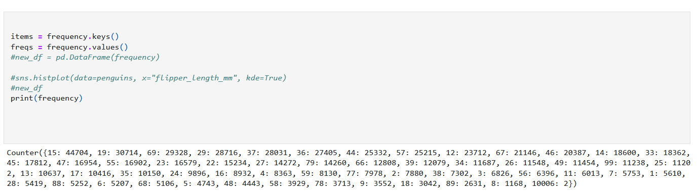
 
 
Below bar graph is generated by the items list along with their frequencies. Based on the figure, it's clear that item 15 has the highest frequency, which is the most commonly used item based on our definition. Meanwhile, item 8 has the lowest frequency.
 
 

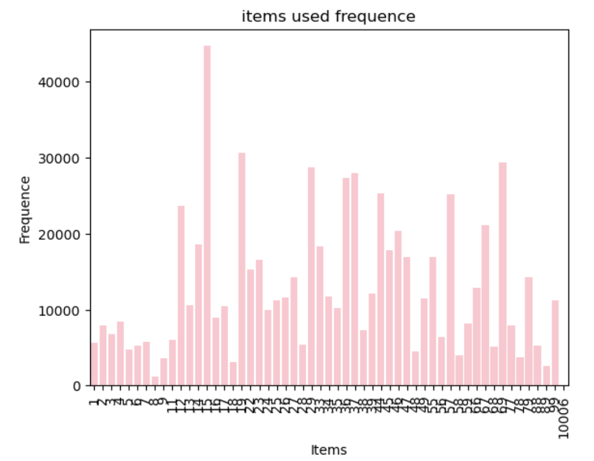
 
 
To conclude, by analyzing these interesting findings, I recommend the players choose item 15, which is B.F.Sword as their first item in order to win in a TFT game.
 
 
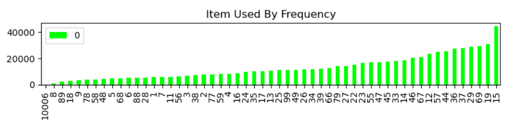

From the below sorted histogram, we can see that the item 19 is the second most commonly used by players. If the players unable to choose item 15 in a round, they are recommonded to use item 19 to form their items.
 
 

### **Conclusion:**
---
In conclusion, for the game players, such as our team members, the best combo to win the game in the current game version would be using champion Ekko and avoid using Xerath; using B.F.Sword item, and using level 1 Chrono combination. This can be a winning tip for game playing. Further more, through analyzing the TFT data set, we understand that video games are based on code behind them, simply change the code can decide whether a champion or strategy is winnable or not. So the best tip for all game player would be keeping up with the change of the game version and select the best strategy for the current version.

Through this project, we've learnt how to use Python, Pandas and Seaborn, which are useful tools for analysing and graphing the data. EDA helps us dealing with our raw data,and the visualization process helps us to group data together with various filters.
